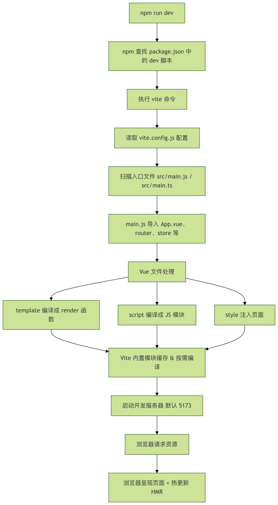

# Vue相关知识
## Vue文件调用顺序
### npm run dev
Vue的本质是js的语法糖，node.js是运行JS的直接面向操作系统的底层引擎，Node.js = V8引擎（负责把 JS 编译成机器码） + libuv 库（负责提供“非阻塞 I/O”和事件循环） + 一堆 C/C++ 绑定（fs、net、crypto、zlib …）  

Vite是一个“前端开发服务器+热更新+即使构建”工具，在本地启动一个HTTP服务，把浏览器的ESM请求实时按需编译，通过WebSocket推送“热模块替换HMR”，页面局部实时更新

### 扫描入口文件src/main.js
Vue需要一个根组件来生成虚拟DOM树，App.vue充当这个根节点，在入口文件中，一般只做三件事：
1. 全局布局（header/footer/sidebar）
2. 放一级路由出口 （router-view/）
3. 注入全局状态（Pinia、Router、i18n…）  

对于这个项目，在main.js做的事情：
1. 加载/写入/本地存储数据的函数
2. 创建全局状态，实时响应显示数据，保存数据，清除数据，清除特定数据
3. 创建应用实例，挂载实例
4. 应用一级路由
5. 监听用户“刷新”行为，需要保证当用户点击刷新按钮时，页面没有清除数据，而是将重定位到总览界面（实际上这里需要并没有成功实现，当用户点击刷新按钮时，旧进程已经kill）
唯一能跨刷新保留数据的api是cookie/url本身的query、path，保存数据需要靠其他的持久化手段

挂载app实例，把vue内部的虚拟DOM树和真实DOM树对接，需要在HTML页面里留下一个接口插座
```
// main.js
import { createApp } from 'vue'
import App from './App.vue'

const app = createApp(App)   // 1. 创建“应用实例”
app.mount('#app')            // 2. 挂载 → 接电线
```
```
//HTML
<div id="app"></div>
```

